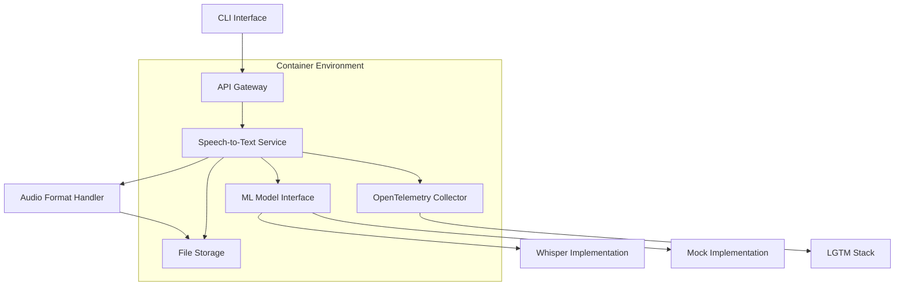

# Design Document

## Overview

The modular speech-to-text system is designed as a containerized, microservices-based architecture that provides flexible speech-to-text conversion capabilities. The system prioritizes modularity, testability, and observability while maintaining simplicity for batch processing use cases.

The architecture follows a plugin-based approach where ML models can be easily swapped through standardized interfaces, enabling testing with mock implementations and future extensibility to different speech-to-text engines beyond Whisper.

## Architecture

### High-Level Architecture



### Service Architecture

The system consists of the following containerized services:

1. **CLI Service**: Command-line interface for batch processing
2. **Speech-to-Text Service**: Core processing engine with ML model abstraction
3. **Audio Format Service**: Handles format detection, validation, and conversion
4. **OpenTelemetry Collector**: Observability and logging aggregation
5. **File Storage**: Persistent storage for audio files and results

### Audio Format Processing

The system supports multiple audio formats through a dedicated format handling layer:

- **Format Detection**: Automatic detection of audio format from file headers
- **Format Validation**: Verification that files are valid audio and match supported formats
- **Format Conversion**: Automatic conversion to model-compatible formats when needed
- **Supported Formats**: wav, mp3, mp4, m4a, flac, ogg with extensible architecture for additional formats

### Design Decisions

**Microservices over Monolith**: Chosen to enable independent scaling, testing, and deployment of components. Each service runs in isolated containers with clear boundaries.

**Plugin Architecture for ML Models**: Implements the Strategy pattern to allow runtime swapping of ML implementations. This enables easy testing with mocks and future support for additional models.

**OpenTelemetry for Observability**: Selected for vendor-neutral observability, allowing flexibility in backend choices without application code changes.

**Docker Compose Orchestration**: Provides simple yet effective service coordination for development and deployment environments.

## Components and Interfaces

### Audio Format Handler

```python
from abc import ABC, abstractmethod
from typing import List, Optional

class AudioFormatHandler:
    SUPPORTED_FORMATS = ["wav", "mp3", "mp4", "m4a", "flac", "ogg"]
    
    @staticmethod
    def validate_format(file_path: str) -> bool:
        """Validate if file format is supported"""
        pass
    
    @staticmethod
    def detect_format(file_path: str) -> Optional[str]:
        """Detect audio format from file headers"""
        pass
    
    @staticmethod
    async def convert_if_needed(file_path: str, target_format: str = "wav") -> str:
        """Convert audio to target format if needed"""
        pass
```

### ML Model Interface

```python
from abc import ABC, abstractmethod
from typing import Union, Dict, Any

class SpeechToTextModel(ABC):
    @abstractmethod
    async def transcribe(self, audio_path: str, audio_format: str = None) -> str:
        """Convert audio file to text, with optional format hint"""
        pass
    
    @abstractmethod
    def get_supported_formats(self) -> List[str]:
        """Return list of natively supported audio formats"""
        pass
    
    @abstractmethod
    def get_model_info(self) -> Dict[str, Any]:
        """Return model metadata and capabilities"""
        pass
    
    @abstractmethod
    async def health_check(self) -> bool:
        """Verify model is ready for processing"""
        pass
```

### CLI Interface

```python
class CLIProcessor:
    def __init__(self, model: SpeechToTextModel):
        self.model = model
    
    async def process_file(self, 
                          input_path: str, 
                          output_path: str = None) -> str:
        """Process single audio file"""
        pass
    
    def display_usage(self) -> None:
        """Show CLI usage instructions"""
        pass
```

### Service Communication

Services communicate through:
- **HTTP APIs**: RESTful interfaces for service-to-service communication
- **File System**: Shared volumes for audio file access
- **OpenTelemetry**: Structured logging and metrics collection

## Data Models

### Audio Processing Request

```python
@dataclass
class AudioRequest:
    file_path: str
    audio_format: str  # "wav", "mp3", "mp4", "m4a", "flac", etc.
    output_format: str = "text"
    model_config: Dict[str, Any] = field(default_factory=dict)
    metadata: Dict[str, Any] = field(default_factory=dict)
```

### Transcription Result

```python
@dataclass
class TranscriptionResult:
    text: str
    confidence: float
    processing_time: float
    model_used: str
    metadata: Dict[str, Any] = field(default_factory=dict)
```

### Model Configuration

```python
@dataclass
class ModelConfig:
    model_type: str  # "whisper", "mock"
    model_path: str
    parameters: Dict[str, Any] = field(default_factory=dict)
    fallback_enabled: bool = True
```

## Error Handling

### Error Categories

1. **Input Validation Errors**: Invalid file paths, unsupported audio formats (non-audio files, corrupted files)
2. **Audio Format Errors**: Unsupported audio codecs, format conversion failures
3. **Model Loading Errors**: Failed model initialization, missing dependencies
4. **Processing Errors**: Audio processing failures, timeout errors
5. **System Errors**: Container failures, network issues

### Error Response Strategy

```python
class STTError(Exception):
    def __init__(self, message: str, error_code: str, details: Dict = None):
        self.message = message
        self.error_code = error_code
        self.details = details or {}

class ErrorHandler:
    def handle_model_error(self, error: Exception) -> STTError:
        """Convert model-specific errors to standardized format"""
        pass
    
    def get_fallback_response(self, request: AudioRequest) -> TranscriptionResult:
        """Provide fallback when primary model fails"""
        pass
```

### Fallback Mechanisms

- **Model Fallback**: Automatic switch to mock model when primary model fails
- **Graceful Degradation**: Return partial results with error indicators
- **Retry Logic**: Configurable retry attempts for transient failures

## Testing Strategy

### Unit Testing

- **Mock Model Implementation**: Lightweight model for fast unit tests
- **Isolated Component Testing**: Each service tested independently
- **Interface Contract Testing**: Verify all implementations follow model interface

### Integration Testing

- **Docker Compose Test Environment**: Separate compose file for integration tests
- **End-to-End Workflows**: Test complete CLI-to-result pipelines
- **Service Communication Testing**: Verify inter-service communication

### Test Configuration

```yaml
# docker-compose.test.yml
version: '3.8'
services:
  stt-service-test:
    build: ./stt-service
    environment:
      - MODEL_TYPE=mock
      - LOG_LEVEL=debug
    volumes:
      - ./test-data:/app/test-data
  
  audio-format-service-test:
    build: ./audio-format-service
    environment:
      - LOG_LEVEL=debug
    volumes:
      - ./test-data:/app/test-data
  
  integration-tests:
    build: ./tests
    depends_on:
      - stt-service-test
      - audio-format-service-test
```

### Testing Approach

1. **Test Doubles**: Mock implementations for external dependencies
2. **Containerized Testing**: All tests run in isolated Docker environments
3. **Coverage Requirements**: Minimum 80% code coverage for core components
4. **Lightweight CI**: GitHub Actions runs only mock models and small test files
5. **Local Heavy Testing**: Full Whisper model testing done in local development environment
6. **Performance Testing**: Baseline performance metrics for regression detection (mock models only in CI)

## Deployment and Operations

### Container Strategy

Each service runs in dedicated containers with:
- **Separate Project Directories**: Each service has its own directory in the repository root (e.g., `/cli`, `/stt-service`, `/audio-format-service`)
- **Resource Limits**: CPU and memory constraints for predictable performance
- **Health Checks**: Built-in health monitoring for orchestration

### Project Structure

```
speech-to-text/
├── .github/
│   └── workflows/
│       ├── ci.yml         # Lightweight CI with mock models
│       └── integration.yml # Optional heavier integration tests
├── cli/                    # CLI service directory
│   ├── Dockerfile
│   ├── requirements.txt
│   └── src/
├── stt-service/           # Core speech-to-text service
│   ├── Dockerfile
│   ├── requirements.txt
│   └── src/
├── audio-format-service/  # Audio format handling service
│   ├── Dockerfile
│   ├── requirements.txt
│   └── src/
├── shared/               # Shared libraries and interfaces
│   └── src/
├── tests/                # Integration and E2E tests
│   ├── Dockerfile
│   └── test-data/        # Small test audio files
├── data/                 # Shared data directory
├── models/              # ML model storage (gitignored)
├── docker-compose.yml
├── docker-compose.test.yml
└── README.md
```

### Orchestration

```yaml
# docker-compose.yml
version: '3.8'
services:
  cli:
    build: ./cli
    volumes:
      - ./data:/app/data
    depends_on:
      - stt-service
  
  stt-service:
    build: ./stt-service
    environment:
      - MODEL_TYPE=${MODEL_TYPE:-whisper}
    volumes:
      - ./models:/app/models
      - ./data:/app/data
    depends_on:
      - audio-format-service
  
  audio-format-service:
    build: ./audio-format-service
    volumes:
      - ./data:/app/data
  
  otel-collector:
    image: otel/opentelemetry-collector-contrib
    volumes:
      - ./otel-config.yml:/etc/otel-collector-config.yml
```

### Observability Implementation

- **Structured Logging**: JSON-formatted logs with correlation IDs
- **Metrics Collection**: Processing time, success rates, model performance
- **Distributed Tracing**: Request flow across service boundaries
- **LGTM Stack Integration**: Loki, Grafana, Tempo, Mimir for complete observability

### Development Workflow

- **Conventional Commits**: Standardized commit messages for automated changelog
- **GitHub Integration**: Issues created for tasks, PRs for feature branches
- **GitHub Actions CI/CD**: Automated testing and validation on push/PR
- **Automated Scripts**: uv-based dependency management and build automation
- **Git Flow**: Feature branches with PR-based code review process

### CI/CD Strategy

```yaml
# .github/workflows/ci.yml
name: CI
on: [push, pull_request]
jobs:
  test:
    runs-on: ubuntu-latest
    steps:
      - uses: actions/checkout@v4
      - name: Run unit tests with mock models
        run: |
          docker-compose -f docker-compose.test.yml up --build --abort-on-container-exit
      - name: Run linting and code quality checks
        run: |
          # Lightweight checks only - no GPU or heavy processing
```

**CI/CD Design Decisions:**
- **Mock Models Only**: GitHub Actions runs only with lightweight mock implementations to avoid GPU requirements
- **Fast Feedback**: Focus on unit tests, linting, and integration tests with mock data
- **Resource Conscious**: No heavy speech-to-text processing in CI to stay within free tier limits
- **Real Model Testing**: Heavy testing with actual Whisper models done locally or in dedicated environments

## Security Considerations

### Container Security

- **Non-root Users**: All containers run with non-privileged users
- **Minimal Base Images**: Distroless or Alpine-based images
- **Volume Permissions**: Restricted file system access
- **Service Isolation**: Each service directory contains only its specific code and dependencies

### Data Security

- **Input Validation**: Strict validation of audio file formats (wav, mp3, mp4, m4a, flac) and paths
- **Format Verification**: File header validation to ensure files match their extensions
- **Temporary File Cleanup**: Automatic cleanup of processing artifacts and format conversions
- **Access Controls**: File system permissions for data isolation

## Performance Considerations

### Scalability

- **Horizontal Scaling**: Independent scaling of processing services
- **Resource Management**: Configurable CPU/memory limits per container
- **Load Balancing**: Future support for multiple processing instances

### Optimization

- **Model Caching**: Persistent model loading across requests
- **Batch Processing**: Efficient handling of multiple files
- **Memory Management**: Streaming processing for large audio files

This design provides a solid foundation for the modular speech-to-text system while maintaining flexibility for future enhancements and different deployment scenarios.